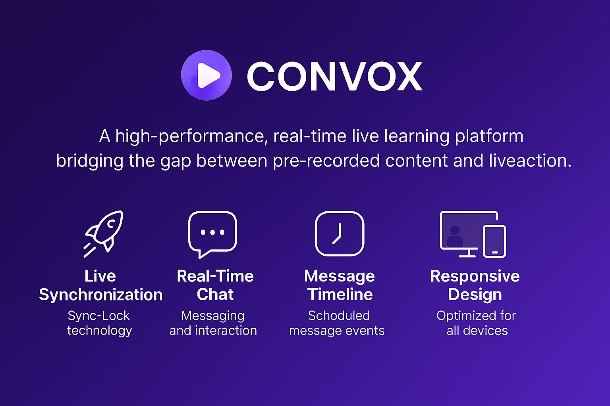

<p align="center">
  
</p>

# 🎥 ZoomStream Sync

**ZoomStream Sync** is a high-performance, real-time live learning platform that bridges the gap between pre‑recorded content and live interaction. It lets instructors schedule video-based sessions that stay perfectly **synchronized** for all participants, with automated timeline messages and **real-time chat**.

***

## ✨ Key Features

*   **🚀 Live Synchronization**: Proprietary **Sync‑Lock** ensures every student sees the exact same frame at the exact same time.
*   **📅 Session Scheduling**: Plan classes with automated start times and countdowns.
*   **💬 Real-Time Chat**: Interactive chat with Instructor badges and automated system messages.
*   **⏱️ Message Timeline**: Schedule messages to trigger at precise timestamps during playback.
*   **📊 Admin Dashboard**: Manage videos, sessions, users, and platform stats.
*   **📱 Responsive UI**: Optimized for Desktop, Tablet, and Mobile.

***

## 🛠️ Tech Stack

*   **Frontend**: Next.js 14 (App Router), React, Tailwind CSS, Lucide React
*   **Backend**: Next.js API Routes, Mongoose (MongoDB)
*   **Real-time**: Pusher Channels
*   **Media**: **Supabase Storage + CDN** (secure private bucket + signed URLs for playback)
*   **State Management**: React Hooks (useMemo, useCallback) & Context API
*   **Authentication**: JWT with Role-Based Access Control

***

## 📋 Prerequisites

Please ensure you have the following:

*   **Node.js**: v18.x or later
*   **MongoDB Atlas**: Database for users, sessions, and metadata
*   **Supabase Project**: For **Storage** (private bucket) and signed URLs
*   **Pusher Account**: For real-time events (chat, sync)

***

## ⚙️ Installation & Setup

1.  **Clone the Repository**
    ```bash
    git clone https://github.com/your-username/ZoomStream_Sync.git
    cd ZoomStream_Sync
    ```

2.  **Install Dependencies**
    ```bash
    npm install
    ```

3.  **Environment Variables**
    Create a `.env` (copy from `.env.example`) and provide credentials for:
    *   **Supabase**: `SUPABASE_URL`, `SUPABASE_ANON_KEY`, `SUPABASE_SERVICE_ROLE_KEY`, `SUPABASE_STORAGE_BUCKET`

    *   **MongoDB**: `MONGODB_URI`

    *   **JWT/Auth**: `JWT_SECRET`

    *   **Pusher**: `PUSHER_APP_ID`, `PUSHER_KEY`, `PUSHER_SECRET`, `PUSHER_CLUSTER`
    > **Notes**
    >
    > *   Keep your bucket **private** (Public OFF) and use **signed URLs** for playback.
    > *   Never expose the **Service Role Key** to the client.

4.  **Run Development Server**
    ```bash
    npm run dev
    ```
    Open **<http://localhost:3000>** in your browser.

***

## 📂 Project Structure

    ZoomStream_Sync/
    ├── app/                  # Next.js App Router (Admin & Student routes)
    │   ├── (admin)/          # Protected Admin Dashboard & Management
    │   ├── (student)/        # Student Join & Live Room
    │   └── api/              # Backend API Endpoints (Auth, Media, Chat, etc.)
    ├── components/           # Reusable UI Components
    │   ├── admin/            # Admin-only components (Modals, Forms, Stats)
    │   ├── student/          # Student components (Player, Chat)
    │   └── ui/               # UI Kit (Buttons, Skeletons, Spinners)
    ├── lib/                  # Utilities (Supabase, Pusher, MongoDB, Auth)
    ├── models/               # Mongoose Schemas
    ├── public/               # Static Assets
    └── next.config.js        # Next.js Configuration

***

## 🛰️ API Documentation

### Authentication

*   `POST /api/auth/register` — Create a new user
*   `POST /api/auth/login` — Authenticate and receive a JWT

### Admin Operations

*   `GET /api/admin/stats` — Dashboard metrics
*   `GET /api/admin/videos` — List uploaded videos (metadata from DB)
*   `POST /api/admin/videos/upload` — **Upload to Supabase Storage** (private bucket)
*   `GET /api/admin/sessions` — List & filter sessions

### Real-time & Sync

*   `POST /api/chat/send` — Send real-time chat message
*   `POST /api/chat/trigger-admin-message` — Internal: triggers scheduled timeline messages

### Media (Supabase)

*   `GET /api/videos/signed-url?path=<storagePath>&expiresIn=<seconds>` — Get **time‑limited signed URL** for playback of a file stored in your **private** Supabase bucket.

> **Storage Model**
>
> *   DB stores: `storageProvider="supabase"`, `storageBucket`, `storagePath` (relative path), `mimeType`, `size`, `thumbnailPath`, `duration` (optional).
> *   Playback: Generate **signed URL** server-side and pass to the client player.

***

## 🔐 Security & Privacy (Media)

*   **Private Bucket**: Turn **Public OFF** for the `videos` bucket in Supabase.
*   **Signed URLs**: Always use short-lived signed URLs (e.g., 10 minutes) for playback.
*   **No Service Role on Client**: Service role key must remain server-only.
*   **Access Control**: Gate media endpoints behind your **JWT RBAC** and session membership checks.

***

## 🎬 Player & Live Sync (Behavior)

*   **Live Sync**: Player auto-seeks to the “global timeline” so every participant watches the same frame.
*   **Countdown State**: Before start time, shows a branded countdown overlay.
*   **Auto-Start**: Uses autoplay‑friendly settings; shows unmute prompt if required by browser policy.
*   **Replay Mode**: Enables native controls for VOD-like navigation after session end.

> **Startup Time (Typical)**
>
> *   Good network: **\~0.5–2s** to first frame
> *   Slow/unstable: **\~2–7s**
> *   Large MP4s or weak devices may take longer

***

## 🚀 Deployment

*   **Vercel** recommended for the frontend and API routes.
*   Ensure all **environment variables** are set in the hosting environment.
*   Configure **production Supabase** project/bucket and **Pusher** credentials.
*   For custom domains, Supabase Storage CDN works transparently.

For step-by-step deployment, see **DEPLOYMENT.md**.

***

## 🛠️ Troubleshooting

*   **Video won’t start**: Ensure signed URL is valid (not expired) and the file path is correct.
*   **Autoplay blocked**: Browser policies may require muted autoplay; unmute with a user gesture.
*   **Upload fails**: Check bucket name, file type (`video/*`), and that Service Role Key is used **server-side**.
*   **MongoDB connection**: Whitelist your server IP / use correct connection string.
*   **Pusher not connecting**: Verify cluster and keys; check region compatibility.
*   **Large uploads**: Prefer stable connections; consider chunked uploads as your library grows.

***

## 💸 Cost & Limits (Free-first)

*   **Supabase (Free Tier)**: Suitable for early prototypes and small libraries (storage & bandwidth limits apply).
*   **Scale Tips**:
    *   Compress video bitrates.
    *   Prune old sessions.
    *   Consider HLS packaging later for adaptive streaming (optional enhancement).

***

## 🤝 Contributing

1.  **Fork** the repository
2.  **Create** your feature branch (`git checkout -b feature/AmazingFeature`)
3.  **Commit** your changes (`git commit -m 'Add AmazingFeature'`)
4.  **Push** to the branch (`git push origin feature/AmazingFeature`)
5.  **Open a Pull Request**

***

## 📄 License

Distributed under the **MIT License**. See `LICENSE` for details.

***

**Built with ❤️ by the ZoomStream Sync Team**

> Using **Supabase Storage** for secure, signed playback—fast, reliable, and perfect for a free-first setup.
